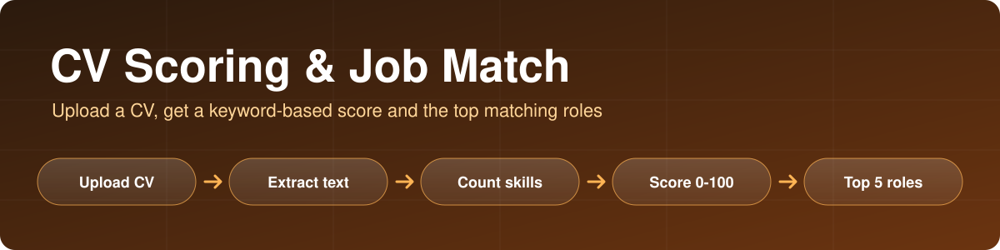
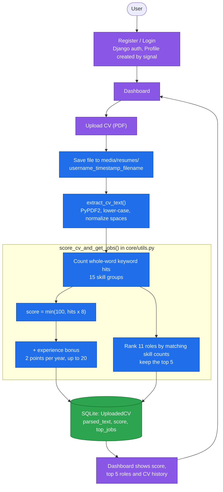

<p align="center">
  
</p>

<p align="center">
  
  
  
  
</p>

# CV Scoring & Job Recommendation System

**A Django web app where users register, upload their CV as a PDF, and get an instant score from 0 to 100 plus the five job roles that best match the skills found in the CV.**

The scoring is rule-based: it extracts the CV text, counts keyword matches for 15 skill groups, and ranks 11 job roles by how many of their skills appear. It does not use machine learning or an LLM.

---

## Key features

- **User accounts**: registration, login and logout using Django's authentication. A `Profile` is created automatically for each new user.
- **CV upload and text extraction**: PDF text is extracted with PyPDF2 and normalized (lower-cased, whitespace collapsed).
- **Skill detection**: whole-word keyword matching across 15 skill groups (Python, SQL, Power BI, Excel, NLP, machine learning, deep learning, Django, Flask/FastAPI, cloud, cybersecurity, UX, legal, support, executive assistant).
- **Score from 0 to 100** based on keyword hits, with a bonus when the CV states years of experience.
- **Top 5 role recommendations** from 11 roles (for example Data Scientist, Data Analyst, ML Engineer, NLP Engineer, Backend Engineer).
- **Dashboard** with an upload form, the top roles for your latest CV, and a history of every uploaded CV with its score and roles.

---

## Architecture



### How the score is computed

```
keyword hits = number of whole-word matches across all skill keywords
score        = min(100, hits x 8)
               + min(20, 2 x years)   if the CV contains "N years of" (or "N+ yrs of")
               capped at 100
```

Each of the 11 roles lists the skills it needs (for example Data Analyst: SQL, Excel, Power BI, Python). A role's relevance is the number of hits on those skills, plus one for each skill name that literally appears in the text. The five highest-scoring roles are shown.

**Example** (input text written for illustration, output produced by `score_cv_and_get_jobs`):

```
"Data analyst with 3 years of experience. Skills: Python, SQL, Power BI, Excel,
 machine learning, scikit-learn."

score:     54     (6 keyword hits x 8 = 48, plus 3 years x 2 = 6)
top roles: Data Scientist, Data Analyst, ML Engineer, NLP Engineer, Backend Engineer
```

---

## Tech stack

| Layer | Choice |
|---|---|
| Backend | Python, Django (project `cvranker`, app `core`) |
| PDF text extraction | PyPDF2 |
| Database | SQLite |
| Forms | django-widget-tweaks |
| Frontend | Django templates with Tailwind CSS (CDN) |

## Project structure

```
CV-Scoring-Job-Recommendation-System/
├── requirements.txt
├── docs/banner.svg
└── cvranker/
    ├── manage.py
    ├── cvranker/            # project settings, urls, wsgi
    └── core/
        ├── models.py        # Profile, UploadedCV
        ├── views.py         # home, register, login, dashboard, upload_cv
        ├── utils.py         # text extraction, skill keywords, scoring, role mapping
        ├── forms.py, urls.py, signals.py, admin.py
        ├── templates/core/  # base, home, login, register, dashboard
        └── static/          # CSS and images
```

---

## Setup

```bash
git clone https://github.com/talha142/CV-Scoring-Job-Recommendation-System.git
cd CV-Scoring-Job-Recommendation-System

python -m venv venv
source venv/bin/activate          # Windows: venv\Scripts\activate
pip install -r requirements.txt

cd cvranker
python manage.py migrate
python manage.py runserver
```

Open http://127.0.0.1:8000, register an account, and upload a PDF CV from the dashboard. The `db.sqlite3` database and the `media/` folder are created locally the first time you run the app.

---

## Project status and limitations

- **Rule-based, not ML.** The score depends on how often keywords appear, so repeating a skill raises it, and skills written differently from the keyword list are missed. It does not compare a CV against a job description.
- Some role definitions use skills that are not in the keyword table (`tensorflow`, `pytorch`, `docker`, `kubernetes`), so they only count when the exact word appears in the text.
- **PyPDF2 is required for PDFs.** Without it, the file would be read as raw text and extraction would fail.
- **Development settings only.** `SECRET_KEY` is a placeholder, `DEBUG = True` and `ALLOWED_HOSTS` is empty. Do not deploy as is.
- **Uploaded CVs contain personal data.** The local database and `media/` folder are git-ignored. Do not commit them.
- The Docker files in `cvranker/core/templates/core/` are not ready to use: the compose file mounts a Windows path from a specific machine, and the Dockerfile is named `Dockerfile.dockerfile`.
- `core/tests.py` is empty, so there are no automated tests yet.

## Future improvements

- Extract skills with an NLP model or an LLM instead of a fixed keyword list.
- Match a CV against a specific job description, for example with embeddings.
- Show which skills were found and which are missing for each recommended role.
- Add tests, move the Docker files to the project root, and read settings from environment variables.
